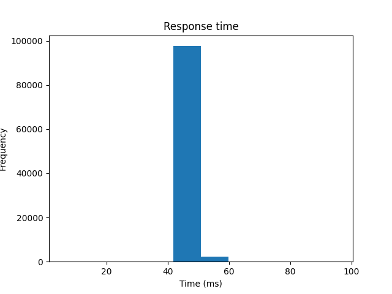

# Workloads on Arm-based AWS instances

_May 2023_

---

Not too long ago [I suggested](https://bignacio.github.io/soc/docs/articles/public-cloud-usage/#can-i-do-anything-to-reduce-my-already-slim-cloud-costs) using Arm-based EC2 instances on AWS as a way to further cost savings.

Depending on the applications and types of workloads, that might not be worth the trouble. As usual, one has to measure. And measure the results again.

However, I went ahead and decided I should check how much of a non-starter that could be. I did that by evaluation one of the most common use cases, a simple REST-based endpoint.

Here's what I found.

## Test setup

The test service exposes a single endpoint to accept POST requests, with a JSON payload, and respond with the exact same that was received.

I did that using 4 different and (I believe) commonly used Web frameworks:

* Django (Python)
* Spring Boot (Java)
* Actix-Web (Rust)
* Gin (Go)

The services were then tested under high request rate using [hey](https://github.com/rakyll/hey) with a JSON payload of 6k.
Each combination of framework and architecture processed 1M requests.

The EC2 instances used were

_(instance types and their configuration as of May 2023)_

* for x64, a t3a.micro with 2 vCPUs and 1G of memory
* for Arm. a t4g.micro with 2 vCPUs and 1G of memory

I chose these instance types based on number of cores and memory size, though the architectures are very different and to for certain applications, these may not be the best attributes for comparison.

## Indicators and expectations

I am looking for throughput and latency for the same service and framework on both architectures.

For that I primarily collected service response time (round trip) at various percentiles.

It's important to note that network and instance jitter can affect the results and I would sometimes have a single request, in 10M, to take 10x the expected time.

Repeating the test many times over under different instances was necessary to eliminate the outliers.

### Note on payload content

The JSON payload consisted of various data types, long and short arrays of single and complex objects.

I also tested much smaller payloads and the results were the same, so I decided to use 6k as a large _enough_ payload size.

## The results

Before diving into the results, I want to mention this is not a comparison between frameworks (though waiting 10-20x for the python app was a little annoying) rather, I was interested in seeing how the same framework (and language compiler/interpreter) behaves on both architectures.

### Python + Django

Response time in milliseconds

|%|x86_64|Arm|
|-|------:|---:|
|99.50|55.6|51.8|
|99.90|59.7|57.0|
|99.99999|92.3|95.8|
|Average|47.2|47.4|
|Min|5.8|5.8|
|Max|92.4|95.0|

Distribution x86_64

Distribution arm64

On the surface it appears that the x86 architecture performed a 2-3% better at the high percentile but up to 99.5, Arm was actually 8% faster.

### Java + Spring Boot

Response time in milliseconds

|%|x86_64|Arm|
|-|------:|---:|
|99.50|8.1|7.3|
|99.90|10.9|9.0|
|99.99999|17.2|23.2|
|Average|1.7|1.6|
|Min|1.3|1.3|
|Max|17.3|23.3|

Distribution x86_64

Distribution arm64

Again we see the same pattern, where the Arm test performs better up until the 99.5 percentile but not so much after that.

The histograms show a higher number of requests in the lower response time bands.

### Go + Gin

Response time in milliseconds

|%|x86_64|Arm|
|-|------:|---:|
|99.50|7.2|7.2|
|99.90|8.9|8.8|
|99.99999|15.5|16.9|
|Average|1.6|1.5|
|Min|1.3|1.3|
|Max|15.6|17.0|

Distribution x86_64

Distribution arm64

The same pattern again with a 8% slower response time for Arm at the 99.99998th percentile.

### Rust + Actix-web

Response time in milliseconds

|%|x86_64|Arm|
|-|------:|---:|
|99.50|2.7|3.0|
|99.90|7.2|7.2|
|99.99999|9.6|10.9|
|Average|1.4|1.4|
|Min|1.2|1.2|
|Max|9.7|11.0|

Distribution x86_64

Distribution arm64

Much like the results for go, thought the histograms suggest a much smaller right tail for Arm.

## Final notes

It does appear that the Arm-based instances can't consistently maintain the same performance at high request rates.

However, I wouldn't take these results as discouraging, quite the opposite. It's very possible that most services won't need to keep those levels of performance at "7 nines" percentiles and the differences these tests show would be immaterial.

Arm instances on AWS are around 10% cheaper than x86(10.6% to be more precise, at the time of this writing). So even if more instances are needed to keep up with load, it's possible the total cost would still be lower.

If the workloads you're running don't depend on specific instruction sets, I'd suggest giving Arm a try.
